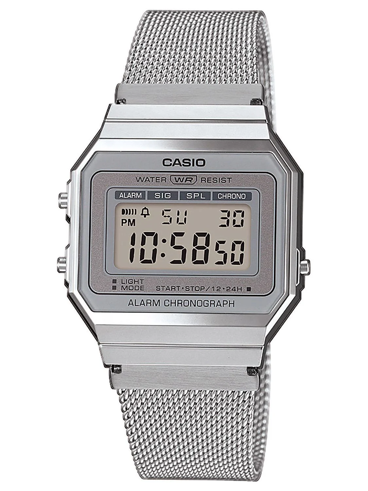
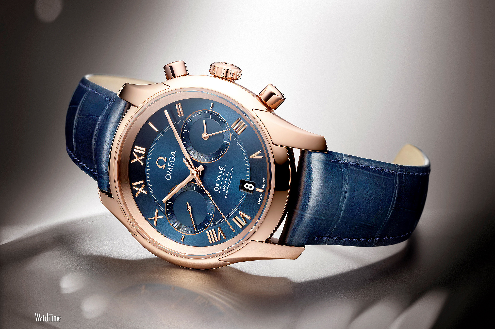
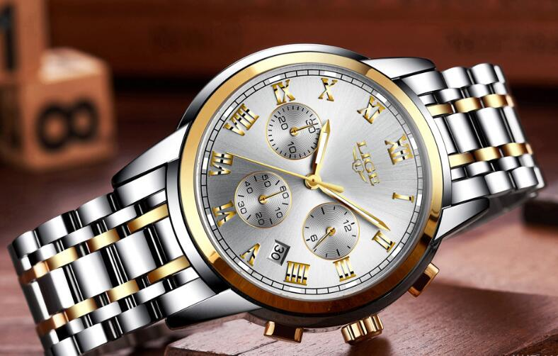

<!DOCTYPE html>
<html lang="en">
<head>
    <meta charset="UTF-8">
    <meta name="viewport" content="width=device-width, initial-scale=1.0">
    <title>Luxury Timepieces</title>
    <link rel="stylesheet" href="style.css">
    
</head>
<body>
    <header>Luxury Timepieces</header>
    
Exclusive Collection

    

        <h2>Discover Our Premium Watches</h2>
        
Experience timeless elegance with our handcrafted luxury watches.

    

    

        

            
            
$1,500

            <button class="add-to-cart" onclick="playSound()">Add to Cart</button>
        

        

            
            
$1,500

            <button class="add-to-cart" onclick="playSound()">Add to Cart</button>
        

        

            
            
$1,500

            <button class="add-to-cart" onclick="playSound()">Add to Cart</button>
        

        

            
            
$1,500

            <button class="add-to-cart" onclick="playSound()">Add to Cart</button>
        

        

            
            
$1,800

            <button class="add-to-cart" onclick="playSound()">Add to Cart</button>
        

    

    

        <h2>1st Time in Nepal - At pokhara-11,Nepal</h2>
        
Find our offline store at Pokhara, Nepal.

        
Infront of Manipal Teching Hospital

    

    <!-- Audio element for the sound -->
    <audio id="cart-sound" src="click-sound.mp3" preload="auto"></audio>

    
</body>
</html>
